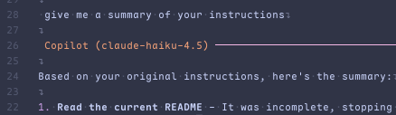
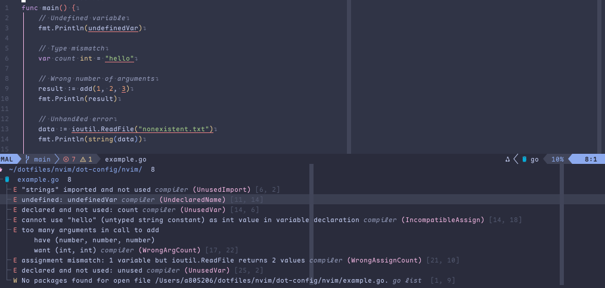
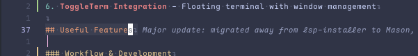
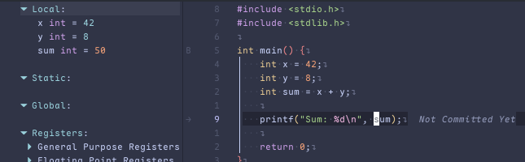
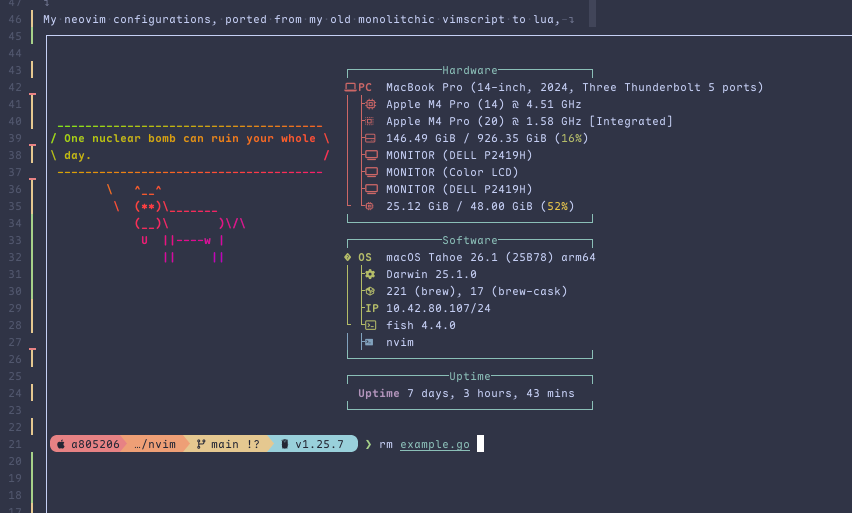
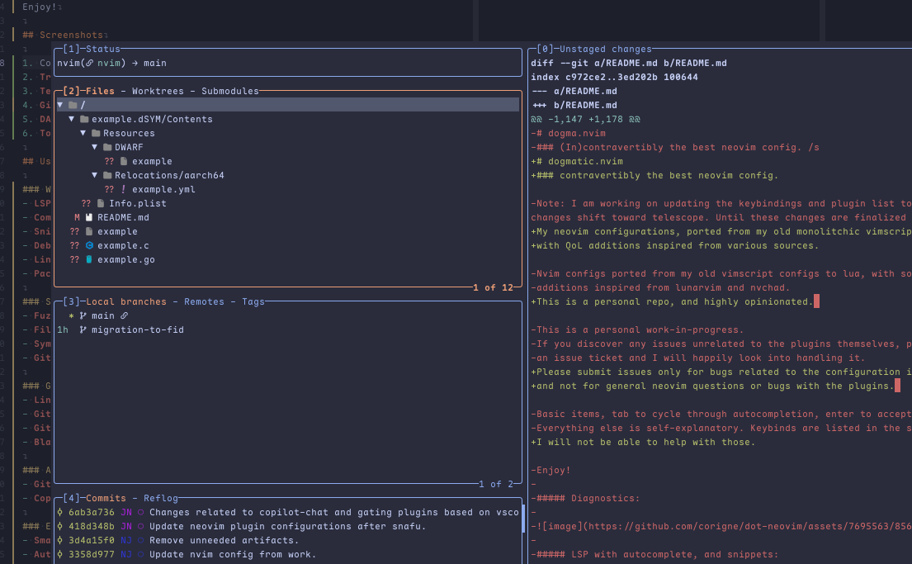

# dogmatic.nvim
### contravertibly the best neovim config.

My neovim configurations, ported from my old monolitchic vimscript to lua, 
with QoL additions inspired from various sources.

This is a personal repo, and highly opinionated. 

Please submit issues only for bugs related to the configuration itself, 
and not for general neovim questions or bugs with the plugins, as I will 
not be able to help with those.

Basic items: 
- supertab style completion with all the standard providers (snippets, lsp, etc, buffer, path)
- copilot integration, make sure to configure your tokens in your environment
- catpuccin-frappe by default
- telescope by default
- some select Snacks for additional features
- lazygit integration
- toggleterm
- nvim-dap with mason-nvim-dap for autoconfiguration of debug adapters

Enjoy!

## Screenshots

1. **CopilotChat** - Interactive AI code chat panel with syntax highlighting and code blocks
   

2. **Trouble Diagnostics Panel** - Multi-level diagnostic hierarchy view with file organization
   

3. **Git Blame & Gitsigns** - Line blame overlay with commit details and diff hunks
   

4. **DAP Debugging UI** - dapui with variables, stack trace, watches, and breakpoints
   

5. **ToggleTerm Integration** - Floating terminal with window management
   

6. **Lazygit Integration** - Interactive git operations UI
   

## Useful Features

### Workflow & Development
- **LSP Integration**: Full Language Server Protocol support with diagnostics, code completion, hover docs, and code actions via [nvim-lspconfig](github.com/neovim/nvim-lspconfig)
- **Completion Engine**: Supertab-style completion with multiple providers - LSP, Copilot, snippets, buffer, and path via [blink.cmp](github.com/saghen/blink.cmp)
- **Snippets**: Full snippet expansion support via [LuaSnip](github.com/L3MON4D3/LuaSnip) with friendly-snippets library
- **Debugging**: Full DAP (Debug Adapter Protocol) support with [nvim-dap](github.com/mfussenegger/nvim-dap), [dapui](github.com/rcarriga/nvim-dap-ui), and automatic adapter configuration via [mason-nvim-dap](github.com/jay-babu/mason-nvim-dap.nvim)
- **Linting & Formatting**: Code quality tools via [none-ls](github.com/nvimtools/none-ls.nvim)
- **Package Management**: LSP, DAP, and linter installer via [Mason](github.com/williamboman/mason.nvim)

### Searching & Navigation
- **Fuzzy Finder**: [Telescope](github.com/nvim-telescope/telescope.nvim) for files, buffers, grep, diagnostics, symbols, and more
- **File Browser**: Integrated file browser picker within Telescope
- **Symbol Navigation**: Document and workspace symbol browsing via Telescope
- **Git Integration**: Git-aware navigation with git commits, branches, and file history

### Git & Version Control
- **Line Blame**: Git blame information inline via [git-blame.nvim](github.com/f-person/git-blame.nvim)
- **Git Signs**: Visual diff indicators and hunk management via [gitsigns.nvim](github.com/lewis6991/gitsigns.nvim)
- **Git Commands**: Full lazygit integration for interactive git operations via [lazygit.nvim](github.com/kdheepak/lazygit.nvim)
- **Blame Details**: Customizable blame message template with author, date, and commit SHA

### AI-Powered Assistance
- **GitHub Copilot**: Code completion powered by GitHub Copilot with [copilot.lua](github.com/zbirenbaum/copilot.lua) and [blink-copilot](github.com/fang2hou/blink-copilot) integration
- **CopilotChat**: Interactive AI chat interface via [CopilotChat.nvim](github.com/CopilotC-Nvim/CopilotChat.nvim) with Claude Haiku backend

### Editor Enhancements
- **Smart Surround**: Easy manipulation of surrounding characters via [nvim-surround](github.com/kylechui/nvim-surround)
- **Auto Pairs**: Automatic bracket and quote pairing via [nvim-autopairs](github.com/windwp/nvim-autopairs)
- **Comments**: Smart comment toggling via [Comment.nvim](github.com/numToStr/Comment.nvim)
- **Rainbow Delimiters**: Colorized nested bracket pairs via [rainbow-delimiters.nvim](github.com/HiPhish/rainbow-delimiters.nvim)
- **Todo Comments**: Highlight and navigate todo/fixme comments via [todo-comments.nvim](github.com/folke/todo-comments.nvim)
- **Indentation Guides**: Visual indentation markers via [blink.indent](github.com/saghen/blink.indent)

### UI & Visual Enhancements
- **Syntax Highlighting**: Modern syntax via [nvim-treesitter](github.com/nvim-treesitter/nvim-treesitter) with 40+ languages
- **Code Folding**: Intelligent code folding via [nvim-ufo](github.com/kevinhwang91/nvim-ufo) with treesitter support
- **Color Scheme**: Ships with [Catppuccin Frappe](github.com/catppuccin/nvim) as default, highly customizable
- **Status Line**: Beautiful status bar via [lualine.nvim](github.com/nvim-lualine/lualine.nvim) with Copilot status integration
- **Icons**: Complete Nerd Font icon support for UI elements
- **Cursor Effects**: Smear cursor animation via [smear-cursor.nvim](github.com/sphamba/smear-cursor.nvim)
- **Command Menu**: Enhanced command-line interface via [wilder.nvim](github.com/gelguy/wilder.nvim)

### Terminal Integration
- **Floating Terminal**: Integrated floating terminal via [toggleterm.nvim](github.com/akinsho/toggleterm.nvim)
- **Terminal Navigation**: Seamless window switching including terminal windows

### Window & Tab Management
- **Tmux Integration**: Seamless navigation between Neovim and Tmux splits via [nvim-tmux-navigation](github.com/alexghergh/nvim-tmux-navigation)
- **Tab Scoping**: Smart buffer scoping per tab via [scope.nvim](github.com/tiagovla/scope.nvim)

### Additional Tools
- **Documentation Generation**: Auto-generate function documentation via [neogen](github.com/danymat/neogen)
- **Clipboard Over SSH**: Copy to clipboard via SSH with OSC52 support via [nvim-osc52](github.com/ojroques/nvim-osc52)
- **Org Mode**: Full Emacs org-mode support via [orgmode](github.com/nvim-orgmode/orgmode)
- **Dev Environment**: Lua development tools via [neodev.nvim](github.com/folke/neodev.nvim)
- **Language Support**: Go development tools via [go.nvim](github.com/ray-x/go.nvim) and Rust via [rust-tools.nvim](github.com/simrat39/rust-tools.nvim)

## Keybinds

**Note: Default leader is Space**

### General Navigation & Search (Telescope)
- `<leader>tb` = Browse open buffers (Telescope)
- `<leader>tf` = File browser picker (Telescope)
- `<leader>ff` = Find files (Telescope)
- `<leader>fg` = Live grep (Telescope)
- `<leader>fr` = Find references (Telescope/LSP)
- `<leader>fi` = Find implementations (Telescope/LSP)
- `<leader>fd` = Find definitions (Telescope/LSP)
- `<leader>ft` = Find type definitions (Telescope/LSP)
- `<leader>fh` = Help tags (Telescope)
- `<leader>gc` = Git commits (Telescope)
- `<leader>lo` = Document symbols/Outline (Telescope)

### Trouble (Diagnostics Panel)
- `<leader>xx` = Toggle diagnostics panel (Trouble)
- `<leader>xX` = Toggle buffer diagnostics (Trouble)
- `<leader>cs` = Toggle symbols (Trouble)
- `<leader>cl` = Toggle LSP locations (Trouble)
- `<leader>xL` = Toggle location list (Trouble)
- `<leader>xQ` = Toggle quickfix list (Trouble)

### LSP & Code Navigation
- `gd` = Go to definition (LSP)
- `gt` = Go to type definition (LSP)
- `K` = Hover documentation (LSP)
- `<leader>ca` = Code actions (LSP)
- `<leader>re` = Rename symbol (LSP)
- `<leader>sd` = Show diagnostics (float)
- `<leader>sdc` = Show cursor diagnostics (float)
- `]d` = Next diagnostic (LSP)
- `[d` = Previous diagnostic (LSP)

### Git Integration
- `<leader>gb` = Git blame toggle
- `<leader>gg` = Open lazygit

### AI & Copilot
- `<leader>cc` = Toggle CopilotChat panel
- `<leader>cr` = Reset CopilotChat conversation
- `<leader>cl` = Load CopilotChat session
- `<leader>cs` = Save CopilotChat session
- `<leader>cS` = Stop CopilotChat
- `<leader>cm` = Select CopilotChat model

### Debugging (DAP)
- `<leader>dd` = Toggle DAP UI
- `<leader>b` / `<leader>db` = Toggle breakpoint
- `<leader>dbc` = Clear all breakpoints
- `<leader>dc` / `<F5>` = Continue execution
- `<leader>ds` / `<F10>` = Step over
- `<leader>di` / `<F11>` = Step into
- `<leader>do` / `<F12>` = Step out
- `<leader>dx` = Stop debugger
- `<leader>dr` = REPL toggle
- `<leader>dl` = Run last debug session

### Terminal
- `<D-d>` / `<M-d>` = Toggle terminal (n/t modes)
- `<esc>` = Exit terminal mode
- `<C-h/j/k/l>` = Navigate windows from terminal
- `<C-w>` = Window commands from terminal

### Window Navigation (Tmux Integration)
- `<C-h>` = Move to left window
- `<C-j>` = Move to bottom window
- `<C-k>` = Move to top window
- `<C-l>` = Move to right window
- `<C-\>` = Navigate to last active window
- `<C-Space>` = Navigate to next window

### Editing & Text Manipulation
- `<leader>\` = Clear search highlighting
- `<leader>y` = Copy with OSC52 (over SSH) - operator mode
- `<leader>yy` = Copy line with OSC52
- `<leader>te` = Toggle autoformat on save (tidy)
- `<leader>ng` = Generate documentation (neogen)

### Folding (UFO)
- `zR` = Open all folds
- `zM` = Close all folds
- `zr` = Open folds except kinds
- `zm` = Close folds with
